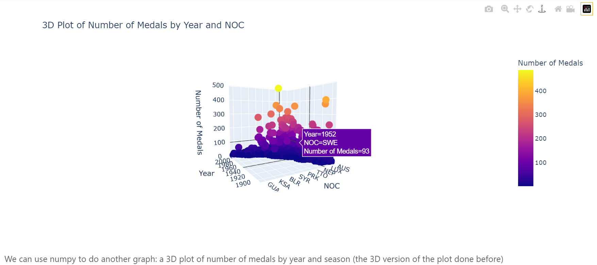

# Data_Visualization
Here is a small project on how to study and present data.\
The two .csv files were too big to be accepted by github (about 50 Mb each), but the plots are visible. In case of problems please contact me.\
After In[21] there is this interacting graph missing: it can be rotated and gives info for each point when you mouse over them.

